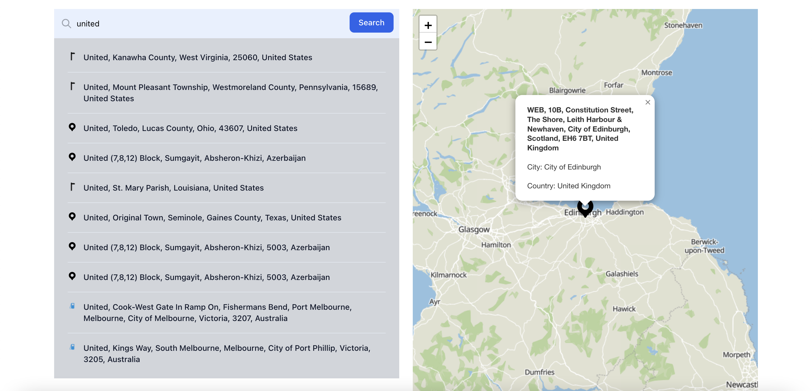

# OSM App

The OSM app is a location search app based on the open street map data written in `Javascript` and React, bootstrapped with [Create React App](https://github.com/facebook/create-react-app). There are two major dependencies worthing of mention, [React Leaflet](https://react-leaflet.js.org/) for displaying the map, and [Tailwind CSS](https://tailwindcss.com/docs/guides/create-react-app) for building the UI. This project leverages [Nominatum](https://nominatim.openstreetmap.org/)' API for transforming `OSM` data returned from `Open Street map` into `GeoJson`.

## Instalation/Setup
To setup, the application locally, follow the instructions below

## Instaling Dependences
In the project directory, you can run:
`npm install` to install all the required dependencies for the project.

### Starting the application
Run `npm start` to start the app in the development mode.\
Open [http://localhost:3000](http://localhost:3000) to view it in your browser.

The page will reload when you make changes.\
You may also see any lint errors in the console.

### Testing
Run the `npm test` to start the test runner in the interactive watch mode.\
See the section about [running tests](https://facebook.github.io/create-react-app/docs/running-tests) for more information.

Each of the files with their corresponding test cases is named with the `.test.js` extension except the mocked location `API` response that is under the `/api/__mock__` folder.

### Building the application

Run `npm run build` to build the app for production. The output of the build files will be under the `build` folder.\
It correctly bundles React in production mode and optimizes the build for the best performance.
The build is minified and the filenames include the hashes.\

Happy Hacking!
